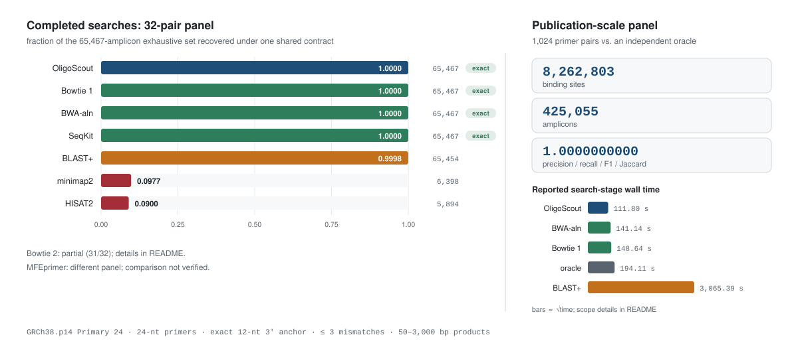

<p align="center">
  <picture>
    <source media="(prefers-color-scheme: dark)" srcset="docs/assets/oligoscout-hero-dark.svg">
    
  </picture>
</p>

<p align="center">
  <strong>Every binding site and every amplifiable product, across the human reference, under one explicit contract.</strong><br>
  Persistent bidirectional FM-indexes · strand-aware binding sites · off-target product assembly · reproducible GRCh38 validation
</p>

<p align="center">
  <a href="https://github.com/AyhanKutukcu/OligoScout/releases"></a>
  
  
  
  
  <a href="LICENSE"></a>
</p>

<p align="center">
  <a href="#why-oligoscout">Why OligoScout?</a> ·
  <a href="#benchmarks">Benchmarks</a> ·
  <a href="#how-it-works">How it works</a> ·
  <a href="#quick-start">Quick start</a> ·
  <a href="#worked-examples-input--command--output">Worked examples</a> ·
  <a href="#record-schema">Record schema</a> ·
  <a href="#reproducibility">Reproducibility</a> ·
  <a href="#project-status">Status</a>
</p>

> [!IMPORTANT]
> **Research preview — pre-1.0.** The core C++ libraries, validation tools, tests and benchmark drivers are implemented and tested. The top-level executable currently exposes only the FM-index demonstration command; `build`, `search` and `search-genome` are reserved names that return a "not implemented" error. Everything shown under [Worked examples](#worked-examples-input--command--output) runs today.

## At a glance

<table>
  <tr>
    <td align="center" width="20%"><strong>1,024</strong><br><sub>primer pairs in the publication panel</sub></td>
    <td align="center" width="20%"><strong>8,262,803</strong><br><sub>validated binding sites</sub></td>
    <td align="center" width="20%"><strong>425,055</strong><br><sub>validated PCR products</sub></td>
    <td align="center" width="20%"><strong>111.80 s</strong><br><sub>single-threaded whole-genome search</sub></td>
    <td align="center" width="20%"><strong>0.65 GiB</strong><br><sub>peak search memory</sub></td>
  </tr>
</table>

## Why OligoScout?

A primer alignment is not a PCR product. A product exists only when two primers bind the **same chromosome**, face **inwards**, and sit at an **amplifiable distance**. Tools that report the best alignment per query, or that are validated only by recovering the intended target, cannot describe the off-target universe — and on our 32-pair panel that gap is large: every completed comparator found all 32 designed targets, yet recovery of the full amplicon set ranged from 9% to 100%.

<table>
  <tr>
    <td width="33%" valign="top">
      <h3>🧬 Short-pattern native</h3>
      Built around exact, bounded-mismatch and 3′-anchor-constrained DNA search — not adapted from long-read or gapped-alignment semantics.
    </td>
    <td width="33%" valign="top">
      <h3>🎯 PCR aware</h3>
      Converts strand-aware binding sites into intended and off-target amplicons, including multiplex cross-product analysis.
    </td>
    <td width="33%" valign="top">
      <h3>🔬 Auditable</h3>
      Ships deterministic panels, independent-oracle comparisons, per-pair metrics, compact evidence and portable hashes.
    </td>
  </tr>
  <tr>
    <td width="33%" valign="top">
      <h3>⚡ Persistent indexes</h3>
      Packed BWT structures, bidirectional FM-index traversal and chromosome-sharded PPFM indexes with an evict-before-load cache.
    </td>
    <td width="33%" valign="top">
      <h3>🧪 Explains, never filters</h3>
      Mismatch profiles, thermodynamics and chemistry profiles annotate the result set — they never silently remove a candidate from it.
    </td>
    <td width="33%" valign="top">
      <h3>📊 Structured reporting</h3>
      Machine-readable TSV/JSON records and a self-contained HTML report, all generated from one record model.
    </td>
  </tr>
</table>

## Benchmarks

The completed-panel comparison below uses one **computational search contract**. External alignment candidates are re-extracted from GRCh38 and checked before product assembly. OligoScout produces native product records; external methods use the benchmark assembly pipeline. Separate or incomplete experiments are identified explicitly:

<p align="center">
  <code>24-nt primers</code> &nbsp;·&nbsp;
  <code>exact 12-nt 3′ anchor</code> &nbsp;·&nbsp;
  <code>≤ 3 mismatches / primer</code> &nbsp;·&nbsp;
  <code>50–3,000 bp products</code> &nbsp;·&nbsp;
  <code>same chromosome, inward-facing</code>
</p>

<p align="center">
  <picture>
    <source media="(prefers-color-scheme: dark)" srcset="docs/assets/oligoscout-benchmark-dark.svg">
    
  </picture>
</p>

### 32-pair panel — completed searches on the legacy Test #79 panel

<!-- OLIGOSCOUT_BENCHMARK_SCOPE_CORRECTION_V1 -->

These are the original Test #79 pairs (64 primers), not the first 32 pairs
of the separate Test #81 publication panel. Product counts and Jaccard
values refer to contract-valid computational candidates, not experimentally
confirmed amplification.

| Method | Profile | Bindings | Amplicons | Target recall | Jaccard vs. OligoScout | Reported search wall | Peak RSS | Index size |
|---|---|---:|---:|:---:|---:|---:|---:|---:|
| **OligoScout** | anchor-aware exhaustive | N/A* | **65,467** | 32/32 | **1.000000000** | **17.02 s** | **680,172 KiB** | 8,541,006,477 B |
| Bowtie 1 | `-v 3 --all`, gapless exhaustive | 675,059 | 65,467 | 32/32 | 1.000000000 | 22.57 s | 3,799,612 KiB | 3,155,892,528 B |
| BWA-aln | seeding disabled, `XA` audited | 675,059 | 65,467 | 32/32 | 1.000000000 | 44.79 s | 4,610,640 KiB | 5,404,490,094 B |
| SeqKit | chunked FMI; 322 reference chunks; at most 3 mismatches | 675,059 | 65,467 | 32/32 | 1.000000000 | 889.40 s | 709,316 KiB | N/A — transient index |
| BLAST+ | `blastn-short`, `e=1000`, matched contract | 650,994 | 65,454 | 32/32 | 0.999801427 | 179.37 s | 11,412,580 KiB | 772,421,068 B |
| minimap2 | short-query, heuristic | 258,924 | 6,398 | 32/32 | 0.097728627 | 22.23 s | 7,820,524 KiB | 7,262,505,841 B |
| HISAT2 | DNA, no splice, all found; heuristic | 102,950 | 5,894 | 32/32 | 0.090030091 | 51.70 s | 4,679,268 KiB | 4,490,800,215 B |

*OligoScout's standalone binding count was not supplied in the archived
Test #79 product-comparison row used here. N/A means unreported, not zero.
The 675,059 counts from other methods are not substituted for an OligoScout
measurement. Product-level equality does not by itself establish binding-set
equality.

> [!NOTE]
> These rows combine archived measurements from different runs, not one
> simultaneous benchmark. OligoScout's 17.02 s is the Test #79 measurement
> for all 32 pairs using a prebuilt PPFM index.
>
> SeqKit's 889.40 s is the sum of 322 sequential reference-chunk calls.
> Each call builds a transient in-memory FM-index. Chunk extraction,
> coordinate conversion, downstream normalization and product assembly
> are excluded from that time. The 709,316 KiB RSS is the maximum across
> calls, not the index size. No persistent SeqKit index size was measured.
>
> Execution scopes, index-preparation costs and filesystem conditions are
> not interchangeable across these runs. These values are configuration-
> specific observations, not universal algorithmic speedup measurements.

#### Bowtie 2 — partial result on the legacy panel

Bowtie 2 completed 31 of the 32 pairwise searches with exit code 0.
The remaining search, `pair_24`, reached the time limit. A timed-out
query is an unmeasured outcome, not evidence that its intended target
could not be found.

| Metric | Observed value |
|---|---:|
| Completed pairwise searches | 31/32 |
| Timed-out pair | `pair_24` |
| Contract-filtered bindings from completed searches | 59,967 |
| Products from completed searches | 13,759 |
| Intersection with the full OligoScout panel | 13,759 |
| Jaccard of the partial output against the full panel | 0.210166954 |
| Sum of completed-call wall times | 284.38 s |
| Wall time recorded for the timed-out call | 1,206.91 s |
| Highest reported RSS among completed calls | 3,793,572 KiB |
| Recorded seed parameters | `-N 0 -L 20` |
| Reused Bowtie 2 index size | 4,170,077,280 B |

The Jaccard above describes partial output against the full 32-pair
reference set; it is not the accuracy of a completed full-panel search.
The 284.38 s excludes the timed-out call and earlier attempts. This is
a heuristic all-reported profile, not a guarantee of exhaustive recovery.
Matched-subset accuracy and timing require the same 31 pairs for every
method. The partial row is deliberately excluded from the completed-panel
recovery chart.

#### MFEprimer — separate experiment, not included in the comparison

The available single-pair measurements concern a 32-pair subset of the
Test #81 panel, not the legacy Test #79 panel shown above. Their product
counts, per-pair timings and Jaccard statistics must not be combined with
the 65,467-product legacy baseline. A matched-panel result will be added
after the raw outputs and measurement scope have been verified.

No MFEprimer accuracy or speedup ratio is claimed here. Binding-level
output was not collected in the evaluated configuration; this is not a
claim that MFEprimer cannot output binding information. It is excluded
from the completed-panel chart while the comparison remains unverified.

### 1,024-pair publication panel — against an independent oracle

Deterministic and difficulty-stratified over the 24 primary chromosomes of **GRCh38.p14**: 1,024 pairs balanced across four 3′-anchor-frequency strata. The oracle scans the reference directly with separate code and consumes no OligoScout output.

| Method | Binding recall | Product recall | Intended recall | Search wall | End-to-end wall |
|---|---:|---:|:---:|---:|---:|
| **OligoScout** | **1.000000** | **1.000000** | 1,024/1,024 | **111.80 s** | **255.91 s** |
| Bowtie 1 + contract filter | 1.000000 | 1.000000 | 1,024/1,024 | 148.64 s | 479.53 s |
| BWA-aln + contract filter | 1.000000 | 1.000000 | 1,024/1,024 | 141.14 s | 419.17 s |
| BLAST+ `blastn-short e=1100` + contract filter | 0.999175 | 0.999995 | 1,024/1,024 | 3,065.39 s | 3,558.70 s |

OligoScout, Bowtie 1 and BWA-aln matched the oracle exactly across **8,262,803 binding sites** and **425,055 products** — agreement at the level of coordinates, strands and pair identities, not merely counts. BLAST+ produced no false positives but omitted 6,814 binding sites and two non-intended products from the highest-difficulty stratum.

<p align="center">
  <a href="benchmarks/test81/README.md"><strong>Explore the reproducible benchmark package →</strong></a><br>
  <sub>Panel · drivers · per-pair metrics · summary tables · figures · SHA-256 manifest</sub>
</p>

## How it works


The dark boxes show candidate generation and verification. Proposed sites are re-extracted from the packed reference and re-checked before acceptance. Verification rejects invalid candidates; completeness additionally requires the search backend to generate every contract-valid candidate. The independent-oracle comparisons test the resulting sets under the documented contract.

### Capability map

| Layer | Implemented research capabilities |
|---|---|
| **Indexing** | FM-index, bidirectional FM-index, packed BWT/reference, sampled suffix arrays, persistent PPFM I/O and chromosome sharding |
| **Search** | Exact, bounded-mismatch, anchor-constrained, candidate, sensitive, adaptive and batched short-pattern search |
| **PCR** | Strand-aware binding sites, primer-pair assembly, off-target products, multiplex cross-pair evaluation |
| **Biology** | Mismatch features, thermodynamics, chemistry profiles, combined features and risk scoring |
| **Output** | Structured report models, TSV/JSON serialization, HTML reporting and benchmark evidence |

## Quick start

### Requirements

- Linux or WSL2
- C++20 compiler
- CMake 3.25 or newer
- Git with submodule support
- GNU Make for the pinned Primer3 dependency

### Clone and build

```bash
git clone --recurse-submodules https://github.com/AyhanKutukcu/OligoScout.git
cd OligoScout

make -C third_party/primer3/src -j4
cmake --preset release
cmake --build --preset release --target primerpair-bifm -j4
```

The internal target keeps its historical name for source compatibility. The user-facing executable is `build/release/oligoscout`.

## Worked examples: input → command → output

> [!NOTE]
> Every command in this section runs in v0.1.0. The output blocks are **abridged** and are shown to illustrate the record schema; exact header strings, column order and numeric formatting are produced by the report serializer in your build. Run the commands for the authoritative output.

### Example 1 — Verify the build

**Input** — the cloned and built repository, nothing else.

**Command**

```bash
ctest --test-dir build/release --output-on-failure
```

**Output** — the publication baseline is 78 of 78 Release tests covering index layers, persistent storage, search modes, chromosome sharding, primer-pair assembly, multiplex behaviour, biological annotation and reporting:

```text
      Start  1: exact_fm_index
 1/78 Test  #1: exact_fm_index ......................   Passed    0.04 sec
      Start  2: checkpoint_rank
 2/78 Test  #2: checkpoint_rank .....................   Passed    0.03 sec
...
      Start 78: annotated_report_pipeline
78/78 Test #78: annotated_report_pipeline ...........   Passed   12.71 sec

100% tests passed, 0 tests failed out of 78
```

### Example 2 — Run the annotated end-to-end pipeline on a primer panel

This is the search contract exercised end to end: shard load → strand-aware search → pair assembly → binding-site extraction from the packed reference → mismatch and thermodynamic features → report serialization.

**Input** — a tab-separated primer panel. Each row is one pair; the expected coordinates are used only to score known-target recall and are never fed into the search:

```tsv
pair_id	forward_primer	reverse_primer	expected_chrom	expected_start	expected_end
PAIR_0001	GTCACTGGCATTCAAGAGCTACAT	ACCTGTGACATTGCCTGGAGATTA	chr22	17084213	17084468
PAIR_0002	TGCAAGGTCTTACCGAATCGATCA	GGCTTAACGTTGCACAAGTCTTCA	chr22	19551002	19551317
PAIR_0003	CAAGTGCCTAAGGTCATCGGATTC	TTGCACCAGTGACTTAGCCATGAA	chr22	23310774	23311089
```

**Command**

```bash
# a small, self-contained panel from the test fixtures
ctest --test-dir build/release -R annotated_report_pipeline --output-on-failure

# the persistent whole-genome path over all 24 PPFM shards
ctest --test-dir build/release -R persistent_genome_search --output-on-failure
```

**Output — binding records (TSV).** One row per verified binding site. Coordinates are zero-based half-open; the mismatch mask is written in the primer's own 5′→3′ orientation, so `.` is a match and the letter is the reference base found there:

```tsv
primer_id	chrom	start	end	strand	orientation	mismatches	mask	last3	last12	dist_3p	exact_3p_run	burden_3p	tm_perfect	tm_observed	delta_tm
PAIR_0001_F	chr22	17084213	17084237	+	forward	0	........................	0	0	-1	24	0.000000	62.41	62.41	0.00
PAIR_0001_R	chr22	17084444	17084468	-	reverse	0	........................	0	0	-1	24	0.000000	61.87	61.87	0.00
PAIR_0001_F	chr14	58210991	58211015	+	forward	2	..G....A................	0	0	16	16	0.036667	62.41	54.02	8.39
PAIR_0001_R	chr14	58211208	58211232	-	reverse	3	.T...C....G.............	0	0	13	13	0.063333	61.87	49.55	12.32
```

**Output — product records (TSV).** One row per assembled amplicon. Only same-chromosome, inward-facing pairs within the length window are emitted:

```tsv
pair_id	chrom	amplicon_start	amplicon_end	length	left_primer	right_primer	total_mismatches	max_burden_3p	max_delta_tm	intended	ranking_score
PAIR_0001	chr22	17084213	17084468	255	PAIR_0001_F	PAIR_0001_R	0	0.000000	0.00	true	0.9871
PAIR_0001	chr14	58210991	58211232	241	PAIR_0001_F	PAIR_0001_R	5	0.063333	12.32	false	0.5013
PAIR_0002	chr9	41003118	41003512	394	PAIR_0002_F	PAIR_0002_R	4	0.056667	6.71	false	0.5644
```

**Output — JSON record.** The same model, with the calibration status carried explicitly so a ranking score can never be mistaken for a probability:

```json
{
  "schema_version": 1,
  "pair_id": "PAIR_0001",
  "chrom": "chr14",
  "amplicon": { "start": 58210991, "end_exclusive": 58211232, "length": 241 },
  "intended": false,
  "left":  { "primer_id": "PAIR_0001_F", "strand": "+", "start": 58210991,
             "mismatches": 2, "mask": "..G....A................",
             "terminal_load": { "1": 0, "2": 0, "3": 0, "5": 0, "8": 0, "12": 0 },
             "exact_3prime_run": 16, "burden_3prime": 0.036667,
             "tm_perfect": 62.41, "tm_observed": 54.02, "delta_tm": 8.39 },
  "right": { "primer_id": "PAIR_0001_R", "strand": "-", "start": 58211208,
             "mismatches": 3, "mask": ".T...C....G.............",
             "terminal_load": { "1": 0, "2": 0, "3": 0, "5": 0, "8": 0, "12": 0 },
             "exact_3prime_run": 13, "burden_3prime": 0.063333,
             "tm_perfect": 61.87, "tm_observed": 49.55, "delta_tm": 12.32 },
  "heterodimer_tm": -3.11,
  "uncalibrated_ranking_score": 0.5013,
  "calibration_status": {
    "ranking_score_calibrated": false,
    "empirical_calibration_applied": false,
    "pcr_probability_available": false
  },
  "chemistry": { "profile": "STANDARD_TAQ", "monovalent_mM": 50.0,
                 "divalent_mM": 1.5, "dntp_mM": 0.6, "dna_nM": 50.0 },
  "source_search_hit_preserved": true
}
```

The HTML report renders the same records as a self-contained page, with the **UNCALIBRATED RANKING SCORE** notice kept visible so a pretty table cannot hide the scientific caveat.

### Example 3 — Reproduce the publication benchmark

**Input** — the packaged 1,024-pair panel and its manifest, both committed to this repository.

**Command**

```bash
cd benchmarks/test81
sha256sum -c SHA256SUMS
```

**Output**

```text
panel/oligoscout_test81_panel_1024.tsv: OK
results/oligoscout_bindings.tsv.gz: OK
results/oligoscout_products.tsv.gz: OK
results/oracle_bindings.tsv.gz: OK
results/oracle_products.tsv.gz: OK
metrics/per_pair_metrics.tsv: OK
metrics/summary.tsv: OK
```

The per-pair metrics and the summary table then read out as:

```text
method          bindings    products   binding_recall  product_recall  intended
oligoscout      8262803     425055     1.0000000000    1.0000000000    1024/1024
oracle          8262803     425055     (truth set)     (truth set)     1024/1024
bowtie1         8262803     425055     1.0000000000    1.0000000000    1024/1024
bwa_aln         8262803     425055     1.0000000000    1.0000000000    1024/1024
blast_e1100     8255989     425053     0.9991753404    0.9999952947    1024/1024
```

See the [benchmark guide](benchmarks/test81/README.md) for environment requirements, index provisioning and full reproduction instructions.

## Record schema

The fields below are the record model the reporting layer serializes. TSV, JSON and HTML are generated from this one model, so coordinates agree across all three formats.

| Group | Fields |
|---|---|
| **Identity & coordinates** | primer / pair id, chromosome, zero-based half-open interval, strand, biological orientation, reference subsequence |
| **Mismatch** | count and fraction, mask in 5′→3′ primer coordinates, load within the terminal 1 / 2 / 3 / 5 / 8 / 12 nt, distance from the 3′ terminus to the nearest mismatch, uninterrupted exact 3′ run length |
| **3′ positional burden** | normalized weight where position *i* carries weight *i*+1 and the mismatched weight is divided by *L*(*L*+1)/2 — 0 for a perfect match, 1 for an all-mismatch primer |
| **Thermodynamics** | perfect-duplex Tm, observed-duplex Tm, ΔTm (never clipped), oligo Tm, hairpin Tm, homodimer any/end, pair heterodimer any/end |
| **Product** | amplicon start / end-exclusive / length, left and right primer identity and orientation, summed mismatch load, maximum 3′ burden, ΔTm summary |
| **Provenance** | chemistry profile, `source_search_hit_preserved`, and a calibration block whose three flags are hardcoded `false` |

> [!WARNING]
> The ranking score is a **deterministic, uncalibrated** ordering heuristic. It is not a PCR success probability and not a clinical indicator. `ranking_score_calibrated`, `empirical_calibration_applied` and `pcr_probability_available` are all `false` by construction. Turning the score into a probability would require labelled wet-laboratory outcomes.

## Reproducibility

Annotation never removes a candidate from the search result, so the enumerated set is independent of the thermodynamic model version — which is what makes the oracle comparison stable across releases.

<details>
<summary><strong>What is intentionally excluded from Git?</strong></summary>

Large or machine-specific artifacts are deliberately excluded:

- GRCh38 FASTA files and source archives
- generated PPFM, Bowtie, BWA, HISAT2, minimap2, MFEprimer and Jellyfish indexes
- multi-gigabyte raw hit tables and full binding/product result trees
- local logs, attestations, backups, build trees and Python environments
- locally installed third-party binaries

This keeps the repository reviewable while retaining the compact evidence and hashes needed to audit the published result.

</details>

<details>
<summary><strong>Historical external benchmark — the BLAST discrepancy audit</strong></summary>

The frozen 32-pair baseline used the same 12-nt anchor, ≤ 3-mismatch and 50–3,000 bp product contract on GRCh38.p14.

| Result | OligoScout | BLAST+ matched contract |
|---|---:|---:|
| Products | 65,467 | 65,454 |
| Known-target recall | 32/32 | 32/32 |
| Shared products | 65,454 | 65,454 |
| Method-only products | 13 | 0 |
| Jaccard | 0.999801427 | 0.999801427 |

All 13 OligoScout-only products were independently revalidated against the reference. They traced to 10 unique BLAST binding sites omitted at the original save threshold: **0/10 recovered at `evalue 1000`, 10/10 at `evalue 1100`**, with an observed HSP E-value near 1060 for a perfect 12-mer. The cause is the statistical save threshold — not seed omission, not coordinate normalisation, not the product assembler. Raising the threshold to 1100 for the 1,024-pair panel reduced, but did not remove, the shortfall.

</details>

<details>
<summary><strong>Repository map</strong></summary>

```text
OligoScout/
├── include/primerpair/     Public C++ headers
├── src/                    Core indexing, search and reporting code
├── tests/                  Regression, validation and benchmark tests
├── tools/                  Research and reference-scale utilities
├── scripts/                Analysis and index-build helpers
├── benchmarks/test81/      Publication benchmark package
├── models/                 Compact trained research-model artifacts
├── docs/assets/            README figures
└── third_party/primer3/    Pinned Primer3 Git submodule
```

Primer3 is pinned as a Git submodule at commit `345cba9ca22fdb8f9f90da9b57948b81b4866330`, and all reported thermodynamics come from that build.

</details>

<details>
<summary><strong>Naming and compatibility note</strong></summary>

The user-facing project and executable name is **OligoScout**. Historical benchmark artifacts and selected internal identifiers retain the earlier `PrimerPair-Search`, `PrimerPair-BiFM` or `primerpair` names to preserve reproducibility and avoid an algorithm-changing namespace migration.

</details>

## Project status

- [x] Core FM-index and bidirectional-index layers
- [x] Persistent chromosome-sharded PPFM indexes
- [x] Anchor-aware, sensitive, adaptive and batched search research paths
- [x] Primer-pair, off-target and multiplex product assembly
- [x] Biological annotation and structured reporting layers
- [x] Deterministic GRCh38 publication benchmark package
- [ ] Complete the stable user-facing `build` command
- [ ] Complete the stable user-facing `search` and `search-genome` commands
- [ ] Add packaged releases and continuous integration
- [ ] Publish a stable 1.0 command-line interface

### Scope boundary

OligoScout is **not a general-purpose sequencing-read aligner**. It does not claim arbitrary gapped alignment, CIGAR/MAPQ generation, soft clipping, splice-aware RNA alignment or multiple-sequence alignment. It also does not model insertions or deletions: the search is gapless Hamming distance with a fixed exact 3′ anchor, and the anchor length is an experimental convention rather than a universal biochemical law. Its focus is auditable short-DNA pattern search and primer-pair analysis under explicit biological constraints.

## Citation

If OligoScout contributes to your research, please cite the software repository and the exact commit used:

```text
Kutukcu, A. (2026). OligoScout (Version 0.1.0) [Computer software].
https://github.com/AyhanKutukcu/OligoScout
```

A manuscript describing the method, the search contract and the benchmark programme is in preparation. For reproducible work, record the commit hash together with the reference assembly, the search contract and the benchmark configuration.

## License

OligoScout is distributed under the [MIT License](LICENSE).

<p align="center">
  <strong>OligoScout</strong><br>
  <sub>Built for explicit contracts, inspectable evidence and reproducible short-DNA search.</sub><br><br>
  Maintained by <a href="https://github.com/AyhanKutukcu">Ayhan Kutukcu</a>
</p>
