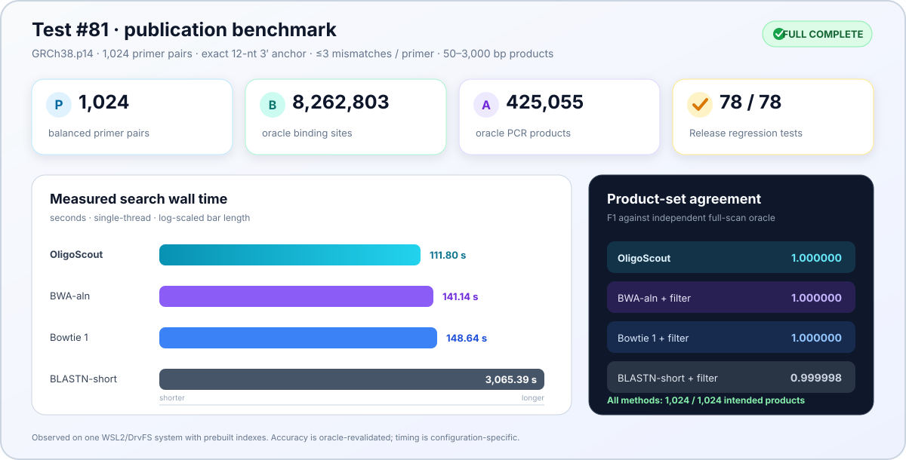

<p align="center">
  
</p>

<p align="center">
  <strong>Reference-scale, anchor-aware search for short DNA patterns and PCR primer pairs.</strong><br>
  Persistent bidirectional FM-indexes · strand-aware binding sites · off-target product assembly · reproducible GRCh38 validation
</p>

<p align="center">
  <a href="https://github.com/AyhanKutukcu/OligoScout/releases"></a>
  
  
  
  <a href="LICENSE"></a>
</p>

<p align="center">
  <a href="#why-oligoscout">Why OligoScout?</a> ·
  <a href="#publication-benchmark">Benchmark</a> ·
  <a href="#how-it-works">How it works</a> ·
  <a href="#quick-start">Quick start</a> ·
  <a href="#reproducibility">Reproducibility</a> ·
  <a href="#project-status">Status</a>
</p>

> [!IMPORTANT]
> **Research preview — pre-1.0.** The core C++ libraries, validation tools and benchmark drivers are implemented and tested. The top-level executable currently exposes the FM-index demonstration command; the user-facing `build`, `search` and `search-genome` commands remain reserved interfaces and are not implemented yet.

## At a glance

<table>
  <tr>
    <td align="center" width="25%"><strong>1,024</strong><br><sub>primer pairs in Test #81</sub></td>
    <td align="center" width="25%"><strong>8,262,803</strong><br><sub>validated binding sites</sub></td>
    <td align="center" width="25%"><strong>425,055</strong><br><sub>validated PCR products</sub></td>
    <td align="center" width="25%"><strong>Exact</strong><br><sub>OligoScout ↔ oracle equality</sub></td>
  </tr>
</table>

## Why OligoScout?

<table>
  <tr>
    <td width="33%" valign="top">
      <h3>🧬 Short-pattern native</h3>
      Built around exact, bounded-mismatch and 3′-anchor-constrained DNA searches—not adapted from long-read or gapped-alignment semantics.
    </td>
    <td width="33%" valign="top">
      <h3>🎯 PCR aware</h3>
      Converts strand-aware binding sites into intended and off-target amplicons, including multiplex cross-product analysis.
    </td>
    <td width="33%" valign="top">
      <h3>🔬 Auditable</h3>
      Ships deterministic panels, independent-oracle comparisons, per-pair metrics, compact evidence and portable hashes.
    </td>
  </tr>
  <tr>
    <td width="33%" valign="top">
      <h3>⚡ Persistent indexes</h3>
      Uses packed BWT structures, bidirectional FM-index traversal and chromosome-sharded PPFM indexes for reference-scale work.
    </td>
    <td width="33%" valign="top">
      <h3>🧪 Biological annotation</h3>
      Supports mismatch profiles, thermodynamic features, PCR chemistry profiles and biological risk scoring.
    </td>
    <td width="33%" valign="top">
      <h3>📊 Structured reporting</h3>
      Produces machine-readable TSV/JSON records and human-readable HTML reports through the research libraries and tools.
    </td>
  </tr>
</table>

## Publication benchmark

<p align="center">
  
</p>

Test #81 is a deterministic, difficulty-stratified benchmark over the 24 primary chromosomes of **GRCh38.p14**. Its 1,024 primer pairs are balanced across four 3′-anchor-frequency strata. Every method is evaluated under one biological contract:

<p align="center">
  <code>24-nt primers</code> &nbsp;·&nbsp;
  <code>exact 12-nt 3′ anchor</code> &nbsp;·&nbsp;
  <code>≤3 mismatches / primer</code> &nbsp;·&nbsp;
  <code>50–3,000 bp products</code>
</p>

| Method | Binding recall | Product recall | Intended recall | Search wall | End-to-end wall |
|---|---:|---:|---:|---:|---:|
| **OligoScout** | **1.000000** | **1.000000** | **1,024/1,024** | **111.80 s** | **255.91 s** |
| Bowtie 1 + contract filter | 1.000000 | 1.000000 | 1,024/1,024 | 148.64 s | 479.53 s |
| BWA-aln + contract filter | 1.000000 | 1.000000 | 1,024/1,024 | 141.14 s | 419.17 s |
| BLASTN-short `e=1100` + contract filter | 0.999175 | 0.999995 | 1,024/1,024 | 3,065.39 s | 3,558.70 s |

OligoScout, Bowtie 1 and BWA-aln exactly matched the independent full-reference oracle across **8,262,803 binding sites** and **425,055 products**. BLASTN-short produced no false-positive contract matches, but omitted 6,814 binding sites and two non-intended products in the highest-difficulty portion of the panel. Every method recovered all 1,024 intended products.

> [!NOTE]
> Bowtie 1, BWA-aln and BLASTN-short are general-purpose alignment/search baselines, not primer-native tools. Their raw hits were independently revalidated and post-filtered to the same biological contract. Timings are single-thread observations from one WSL2/DrvFS run with prebuilt indexes; they are configuration-specific measurements, not universal speedup claims.

<p align="center">
  <a href="benchmarks/test81/README.md"><strong>Explore the reproducible Test #81 package →</strong></a><br>
  <sub>Panel · benchmark drivers · per-pair metrics · summary tables · figures · SHA-256 manifest</sub>
</p>

## How it works


### Capability map

| Layer | Implemented research capabilities |
|---|---|
| **Indexing** | FM-index, bidirectional FM-index, packed BWT/reference, sampled suffix arrays, persistent PPFM I/O and chromosome sharding |
| **Search** | Exact, bounded-mismatch, anchor-constrained, candidate, sensitive, adaptive and batched short-pattern search |
| **PCR** | Strand-aware binding sites, primer-pair assembly, off-target products, multiplex cross-pair evaluation |
| **Biology** | Mismatch features, thermodynamics, chemistry profiles, combined features and risk scoring |
| **Output** | Structured report models, TSV/JSON serialization, HTML reporting and benchmark evidence |

## Quick start

### Requirements

- Linux or WSL2
- C++20 compiler
- CMake 3.25 or newer
- Git with submodule support
- GNU Make for the pinned Primer3 dependency

### Clone and build

```bash
git clone --recurse-submodules \
  https://github.com/AyhanKutukcu/OligoScout.git

cd OligoScout

make -C third_party/primer3/src -j4
cmake --preset release
cmake --build --preset release --target primerpair-bifm -j4
```

The internal target retains its historical name for source compatibility. The generated user-facing executable is:

```text
build/release/oligoscout
```

### Run the current CLI demonstration

```bash
./build/release/oligoscout --help
./build/release/oligoscout demo
```

> [!WARNING]
> The visible `build`, `search` and `search-genome` commands are placeholders in version 0.1.0. They return a clear “not implemented” error and do not read a FASTA file or create an index. Full research workflows currently run through the C++ libraries, dedicated tools, tests and benchmark drivers.

## Reproducibility

### Run the Release regression suite

```bash
ctest --test-dir build/release --output-on-failure
```

The publication baseline contains **78/78 passing Release tests** spanning the index layers, persistent storage, search modes, chromosome sharding, primer-pair assembly, multiplex behavior, biological annotation, reports and supporting data structures.

### Inspect Test #81

```bash
cd benchmarks/test81
sha256sum -c SHA256SUMS
```

The repository includes the compact 1,024-pair panel, benchmark source and drivers, tiny smoke fixtures, per-pair comparison metrics, summary reports, figures and provenance records. See the [Test #81 guide](benchmarks/test81/README.md) for environment requirements and full reproduction instructions.

<details>
<summary><strong>What is intentionally excluded from Git?</strong></summary>

Large or machine-specific artifacts are deliberately excluded:

- GRCh38 FASTA files and source archives
- generated PPFM, Bowtie, BWA, HISAT2, minimap2 and Jellyfish indexes
- multi-gigabyte raw hit tables and full binding/product result trees
- local logs, attestations, backups, build trees and Python environments
- locally installed third-party binaries

This keeps the repository reviewable while retaining compact evidence and hashes needed to audit the published result.

</details>

<details>
<summary><strong>Historical external benchmark — Test #79</strong></summary>

The frozen 32-pair Test #79 baseline used the same 12-nt anchor, ≤3-mismatch and 50–3,000 bp product contract on GRCh38.p14.

| Result | OligoScout / historical PrimerPair-Search | BLAST+ matched contract |
|---|---:|---:|
| Products | 65,467 | 65,454 |
| Known-target recall | 32/32 | 32/32 |
| Shared products | 65,454 | 65,454 |
| Method-only products | 13 | 0 |
| Jaccard | 0.999801427 | 0.999801427 |

All 13 OligoScout-only products were independently revalidated. They represented 10 unique BLAST binding sites omitted at the original save threshold: 0/10 were recovered at `evalue 1000`, 10/10 at `evalue 1100`, with an observed HSP E-value near 1060.

MFEprimer is recorded only as **environment-limited**: its index build did not complete and its search benchmark was not executed. No MFEprimer performance or accuracy claim is made.

</details>

## Project status

- [x] Core FM-index and bidirectional-index layers
- [x] Persistent chromosome-sharded PPFM indexes
- [x] Anchor-aware, sensitive, adaptive and batched search research paths
- [x] Primer-pair, off-target and multiplex product assembly
- [x] Biological annotation and structured reporting layers
- [x] Deterministic GRCh38 publication benchmark package
- [ ] Complete the stable user-facing `build` command
- [ ] Complete the stable user-facing `search` and `search-genome` commands
- [ ] Add packaged releases and continuous integration
- [ ] Publish a stable 1.0 command-line interface

### Scope boundary

OligoScout is **not a general-purpose sequencing-read aligner**. It does not claim arbitrary gapped alignment, CIGAR/MAPQ generation, soft clipping, splice-aware RNA alignment or multiple-sequence alignment. Its focus is auditable short-DNA pattern search and primer-pair analysis under explicit biological constraints.

<details>
<summary><strong>Repository map</strong></summary>

```text
OligoScout/
├── include/primerpair/     Public C++ headers
├── src/                    Core indexing, search and reporting code
├── tests/                  Regression, validation and benchmark tests
├── tools/                  Research and reference-scale utilities
├── scripts/                Analysis and index-build helpers
├── benchmarks/test81/      Publication benchmark package
├── models/                 Compact trained research-model artifacts
└── third_party/primer3/    Pinned Primer3 Git submodule
```

Primer3 is pinned as a Git submodule at commit `345cba9ca22fdb8f9f90da9b57948b81b4866330`.

</details>

<details>
<summary><strong>Naming and compatibility note</strong></summary>

The user-facing project and executable name is **OligoScout**. Historical benchmark artifacts and selected internal identifiers retain the earlier `PrimerPair-Search`, `PrimerPair-BiFM` or `primerpair` names to preserve reproducibility and avoid an algorithm-changing namespace migration.

</details>

## Citation

If OligoScout contributes to your research, please cite the software repository and the exact commit used:

```text
Kutukcu, A. (2026). OligoScout (Version 0.1.0) [Computer software].
https://github.com/AyhanKutukcu/OligoScout
```

For reproducible work, record the commit hash together with the reference assembly, search contract and benchmark configuration.

## License

OligoScout is distributed under the [MIT License](LICENSE).

<p align="center">
  <strong>OligoScout</strong><br>
  <sub>Built for explicit contracts, inspectable evidence and reproducible short-DNA search.</sub><br><br>
  Maintained by <a href="https://github.com/AyhanKutukcu">Ayhan Kutukcu</a>
</p>
